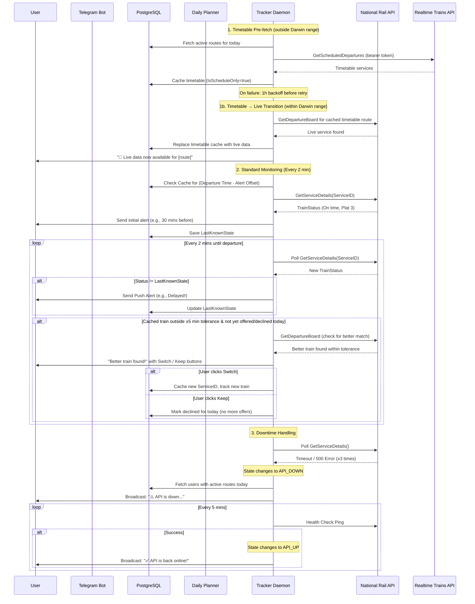

# DFA — Train Route Monitor Bot

## 1. Feature Description

### 1.1. Why?

Commuters in the UK frequently experience train delays, cancellations, and unexpected platform changes. Manually checking the National Rail app every morning and evening is repetitive and easy to forget. We need a system that proactively monitors a user's specific daily commute and pushes alerts to them automatically.

### 1.2. Goal

Build a Telegram bot where users can configure up to two daily train routes (e.g., "Morning Commute" and "Evening Commute"). The system will automatically monitor the National Rail API and push real-time notifications about train status, platform changes, and delays. Users see scheduled train information immediately during route creation via the Realtime Trains timetable API, with a seamless transition to live Darwin data closer to departure.

### 1.3. Challenges / Risks

- **Upstream Unreliability:** The National Rail API (Darwin OpenLDBWS) can be unstable or return 500 errors during peak times.
- **Polling Limits:** As the user base grows, polling every 1–2 minutes per active route could hit rate limits (3 million/month free tier).
- **State Synchronization:** Accurately maintaining the LastKnownState is critical to prevent spamming the user with duplicate or redundant notifications.

## 2. Non-Functional Requirements

- **Maintainability:** The system must use interfaces (`TrainClient`, `ScheduleClient`, `Notifier`) to allow seamless swapping of external APIs (e.g., moving to TfL, replacing HTTP polling with Darwin Push Port websockets) without changing core business logic.
- **Performance:** Background daemons must run concurrently (via goroutines) without blocking the Telegram webhook or polling mechanisms.
- **Resilience (Circuit Breaker):** The system must gracefully handle National Rail API downtime by transitioning to an `API_DOWN` state, notifying opted-in users (`/alerts` toggle, disabled by default), and auto-recovering when the API stabilizes.

## 3. Sequence Diagram



## 4. Actions

1. **Infrastructure Setup:**
   - Initialize Go project and Go modules.
   - Setup `docker-compose.yml` with PostgreSQL 18 and App service.
   - Configure `slog` for structured logging.

2. **Database Integration:**
   - Create migrations for `users` and `routes` tables.
   - Create a DB seeder or load a JSON file with UK CRS station codes for input validation.

3. **Transport Module:**
   - Implement `TrainClient` interface for live data (Darwin OpenLDBWS SOAP API).
   - Implement `ScheduleClient` interface for timetable data (Realtime Trains Next Generation REST API).
   - Darwin: `GetDepBoardWithDetails`, `GetServiceDetails` (SOAP/XML).
   - RTT: `GET /gb-nr/location` with Bearer token auth (REST/JSON). Rate limited: 30/min, 750/hour, 9000/day.

4. **Presentation Module (Telegram):**
   - Implement Bot State Machine (`/start`, `/add`, `/status`, `/stop`, `/resume`, `/delete`, `/help`) using telebot v4.
   - Implement input validation (station codes via fuzzy search, time formats).
   - Inline button UI for train selection and route deletion.
   - Days-of-week selection (weekdays, weekends, specific days).

5. **CI Pipeline:**
   - GitHub Actions workflow (`.github/workflows/pr-check.yml`) runs on every pull request to `main`.
   - Six parallel jobs: format check (`gofmt`), static analysis (`go vet`), lint (`golangci-lint`), generated code freshness (`sqlc diff`), tests (`go test -race`), build verification.
   - All jobs must pass before merging.

6. **Core Module:**
   - Implement Daily Planner cron job (runs at 02:00).
   - Implement Tracker Daemon ticker (runs every 2 minutes) with `LastKnownState` logic.
   - Implement Circuit Breaker logic for API health monitoring and broadcast messaging.
   - Nearest-train suggestion when exact match not found within ±5 min tolerance.
   - Better train detection: when tracking a non-ideal train (outside ±5 min), daemon checks if a closer match has appeared and offers user the option to switch via inline buttons (once per day).
   - Scheduled train preview: during route creation, query RTT for timetable data when outside Darwin range. Show scheduled trains immediately with "📅 Scheduled" label.
   - Two-mode data: timetable (RTT, `IsScheduleOnly`) → live (Darwin). Daemon transitions automatically with proactive notification. Alerts only fire with live data.

## 5. C4 Diagrams

N/A — Architectural complexity does not currently warrant full C4 modeling beyond the provided sequence flow.

## 6. Database Structure

```sql
Table users {
  id UUID [primary key]
  telegram_chat_id BigInt [unique]
  created_at Timestamp
  state String
}

Table routes {
  id UUID [primary key]
  user_id UUID [ref: > users.id]
  label String
  from_station_crs String
  to_station_crs String
  departure_time Time
  days_of_week Integer
  alert_offsets Integer[]
  is_active Boolean
}
```

> `user_id` in `routes` is intentionally NOT unique to allow up to 2 routes per user.

## 7. API Documentation

N/A — Application interacts exclusively via Telegram Bot UI; no public REST API exposed.

## 8. Test Coverage Requirements

- NOT to reduce overall test coverage.
- 100% of interfaces (`TrainClient`, `ScheduleClient`, `Notifier`) must be covered via mocks.
- 100% of Bot State Machine transitions must be covered by unit tests.
- Circuit Breaker logic state changes (`API_UP` <-> `API_DOWN`) must be fully tested.
- Better train detection: all edge cases covered — tolerance checks, flag expiry, API failures, duplicate offer prevention, integration with status change alerts.
- Scheduled train preview: RTT client parsing/filtering, planner FindScheduledTrains/PlanRouteFromSchedule, handler RTT fallback, daemon timetable pre-fetch/transition, /status timetable display, backoff on failure.